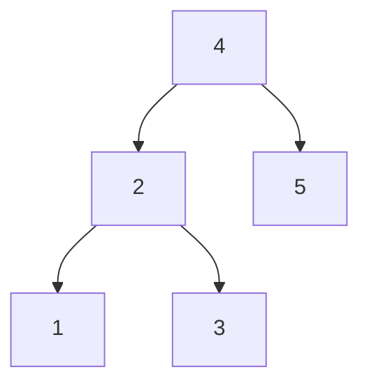

---
categories:
  - daily_dsa
title: "Day 4: Two Sum - BST Version"
tags: 
  - sum
  - BST
  - BFS
---
# DAY 4: TWO SUM - BST VERSION

Given a binary search tree and a number `n`, return `true` if find two numbers in the tree that sums up to `n`.

Input : Parameters and Boundaries
Output : Result

## Example

**Input:** `n = 3`

**Binary search tree:**



**Output:** `true`

## Hint

Use Breadth First Search (BFS) to traverse the entire tree.


## Implementation

### C/C++

=== "Solution 1"
    ```cpp title="day4-1.cpp"
    --8<-- "docs/daily_dsa/day-04/day4-1.cpp"
    ```

=== "Solution 2"
    ```cpp title="day4-2.cpp"
    --8<-- "docs/daily_dsa/day-04/day4-2.cpp"
    ```